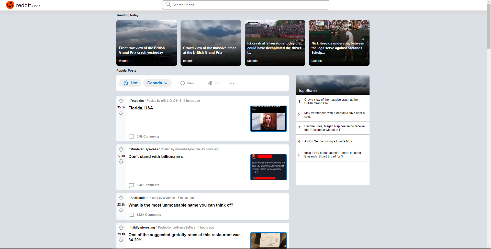

# Codecademy - Reddit Client solution

This is a solution to the [Build your own Reddit App Challenge on Codecademy](https://www.codecademy.com/paths/full-stack-engineer-career-path/tracks/fscp-22-portfolio-project-reddit-client/modules/wdcp-22-reddit-client/kanban_projects/reddit-client).

## Table of contents

- [Overview](#overview)
  - [The challenge](#the-challenge)
  - [Screenshot](#screenshot)
  - [Links](#links)
- [My process](#my-process)
  - [Built with](#built-with)
  - [What I learned](#what-i-learned)
  - [Continued development](#continued-development)
  - [Useful resources](#useful-resources)
- [Author](#author)
- [Acknowledgments](#acknowledgments)


## Overview

### The challenge

Users should be able to:

- Browse a Reddit - like UI for the latest popular stories
- See hover and focus states for interactive elements
- Sort the popular posts in the reddit feed by using the Hot, New and Top buttons. 

### Screenshot



### Links

- Solution URL: [https://github.com/cecmahumane/reddit-client]

## My process
	
### Built with

- HTML5
- CSS
- Flexbox
- CSS Grid
- [React](https://reactjs.org/) - JS library
- [Redux Toolkit](https://redux-toolkit.js.org/) - For state management
- [jsonata](https://jsonata.org/) - JSON query and transformation language


### What I learned

This was the first time I had implemented CSS grid in a project. I used it on the reddit feed items to make the organization 
of the content dynamic and consistent. This was also my first time using the Redux Toolkit Query. I'm happy I got it to work. 

```css

.feed-item-content {
    background-color: #FFFFFF;
    width:100%;
    border-radius: 0px 4px 4px 0px;
    padding-left: 10px; 
    display: grid;
    grid-template-columns: 4fr 1fr;
    grid-template-rows: 1fr auto auto 1fr;
}
```
```js

import { createApi, fetchBaseQuery } from '@reduxjs/toolkit/query/react'

export const redditFeedDataApi = createApi({
    reducerPath: 'redditFeedData',
    baseQuery: fetchBaseQuery({
        baseUrl: 'https://www.reddit.com',
    }),
    endpoints: (builder) => ({
        getRedditFeedData: builder.query({
            query: () => '/r/popular.json',
        })
    })
});

export const { useGetRedditFeedDataQuery } = redditFeedDataApi;


```

### Continued development

In the future I would like to do more work integrating CSS grid into my projects as I am much more comfortable using flexbox than grid. 

If I learned how to use the official Reddit Api I would like to add subreddit Icons as well as a functioning search bar. I chose to not implement the search bar in the reddit clones current state due to it having limited functionality.


### Useful resources

- [RTK Query Tutorial - Hong Ly](https://www.youtube.com/watch?v=9V-Up8QT7tM&t=903s) - This helped me see first hand how the query was applied. It helped clarify details I found confusing after reading the RTK Query documentation.
- [RTK Query Tutorial - Dave Gray](https://www.youtube.com/watch?v=HyZzCHgG3AY) - This a great compliment to the above video. I'd recommend it to anyone still learning this concept.


## Author

- Website - [Cecil Mahumane](https://github.com/cecmahumane)


## Acknowledgments

Special thanks to Frank Davies for providing code reviews and helping me resolve some stumbling blocks, and special thanks to @MikeJ on the Codecademy discord for providing me with advice and troubleshooting with RTK Query. 


